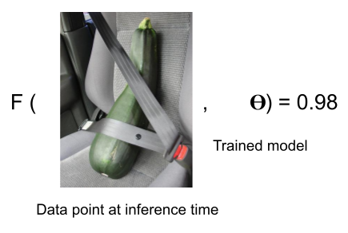
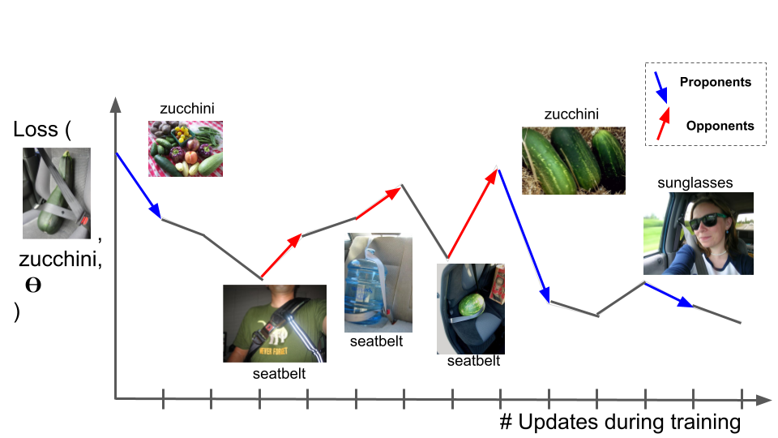
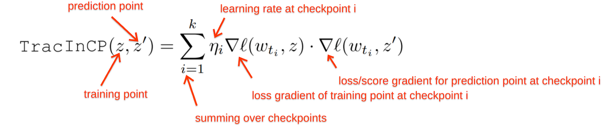
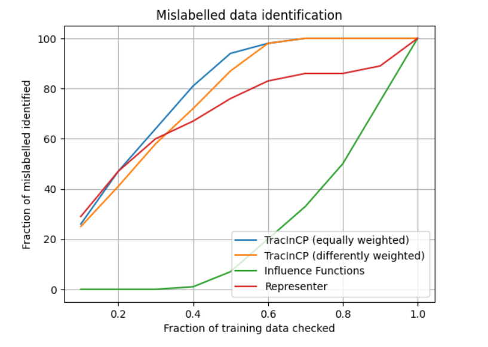

# TracIn : Estimating Training Data Influence by Tracing Gradient Descent

- Syrine Enneifer 2049467
- Giordano Pagano 2077179


In this project is implemented the method introduced in the paper Estimating Training Data Influence by Tracing Gradient Descent (https://arxiv.org/pdf/2002.08484.pdf).

# Introduction:
We present a method called TracIn, designed to determine the influence of a training example on a prediction made by the model.
We aim to analyze the evolution of the loss of a test point over the training process whenever the training example of
interest was utilized.

## Idealized Notion of Influence
Given a set of n training points S = {z<sub>1</sub>, z<sub>2</sub>, . . . , z<sub>n</sub> ∈ Z}, we train the predictor by finding parameters *w* that minimize the training loss ∑<sub>i</sub>L(w, z<sub>i</sub>), *i = 1,...,n* via an iterative optimization procedure (such as Stochastic Gradient Descent) which utilizes one training example z<sub>t</sub> ∈ S in iteration t, updating the parameter vector from w<sub>t</sub> to w<sub>t+1</sub>. Then the idealized notion of influence of a particular training example z ∈ S on a given test example z<sub>0</sub> ∈ Z is defined as the total reduction in loss on the test example z<sub>0</sub> that is induced by the training process whenever the training example z is utilized :

**<p align="center">TracInIdeal(z, z') = Σ<sub>[t:z<sub>t</sub>=z]</sub>   L(w<sub>t</sub>, z') − L(w<sub>t+1</sub>, z<sub>0</sub>)</p>**

# Example:
This method is exemplified in the context of an image classification task, where the model's objective is to predict the subject of the test image (*"zucchini" here*).
We would like to identify the influence of a training data point on F(data point at inference time).



## Proponents and Opponents

As the model advances during training, it encounters different training examples, affecting the loss on the test image. Indeed, whenever a particular training example is visited, this leads to adjustments in the model's parameters, subsequently affecting the prediction and loss for the test example. 

By tracing the training example's impact throughout the training process, the change in loss for the test example can be attributed to that specific training example. Proponents, such as images of zucchinis, decrease loss, while opponents, like images of seatbelts, increase loss. For instance, an image labeled "sunglasses" serves as a proponent because it includes a seatbelt, pushing the model to better differentiate between zucchinis and seatbelts.



TracIn is simple to implement; all it needs is the ability to work with gradients, checkpoints, and loss functions.

# Implementation
Starting from the concept of Ideal TracIn, we can approximate the change in the loss of a test example in a given iteration t via a simple first-order approximation: 
L(w<sub>t+1</sub>, z<sub>0</sub>) = L(w<sub>t</sub>, z<sub>0</sub>) + ∇L(w<sub>t</sub>, z<sub>0</sub>) · (w<sub>t+1</sub> − w<sub>t</sub>) + O(|w<sub>t+1</sub> − w<sub>t</sub>|<sup>2</sup>).
Now, since we employ Stochastic Gradient Descent as our optimizer during traning, using the training point z<sub>t</sub> at iteration t, the change in parameters is:
w<sub>t+1</sub> − w<sub>t</sub> = −η<sub>t</sub>∇L(w<sub>t</sub>, z<sub>t</sub>) (where η<sub>t</sub> is the step size at iteration t).
Then, we arrive at the following first-order approximation for the change in the loss: 
L( w<sub>t</sub>, z<sub>0</sub>) − L(w<sub>t+1</sub>, z<sub>0</sub>) ≈ η<sub>t</sub>∇L(w<sub>t</sub>, z<sub>0</sub>) · ∇L(w<sub>t</sub>, z<sub>t</sub>).
We call this first-order approximation TracIn, our primary notion of influence: 
**<p align="center">TracIn(z, z') = ∑<sub>[t:zt=z]</sub> η<sub>t</sub>∇L(w<sub>t</sub>, z') · ∇L(w<sub>t</sub>, z<sub>t</sub>).</p>**

However, in practice, the test example remains unknown during training, presenting a challenge. However, this limitation can be addressed by leveraging the checkpoints produced by the learning algorithm, providing a snapshot of the training process. 

Additionally, another challenge arises from the learning algorithm's simultaneous visitation of multiple points rather than individual ones, necessitating a method to discern the relative impacts of each training example. This can be achieved through the application of Stochastic Gradient Descent. These two strategies collectively constitute the TracIn method:



# Evaluations
To underscore TracIn's effectiveness, we contrast it with Influence Functions and the Representer Point Selection method. Specifically, we analyze their performance in identifying outliers by assessing the self-influence score, which represents the influence of a training point on its own prediction. Since mislabelled data points are strong proponents for themselves, this characteristic enables us to effectively showcase TracIn's efficiency in swiftly identifying them.


# Results
As shown in the graphs, the TracIn method is the most efficient of all, in particular when the learning rate is the same across checkpoints.



# How to run the code
Install the needed librairies using the following command : 
```
pip install torch torchvision numpy matplotlib 
```
The file extension is '*.ipybn*' so it can be uploaded in a colab session and the user can run each cell sequentially.
